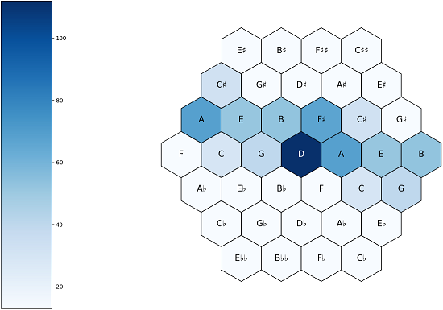
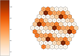
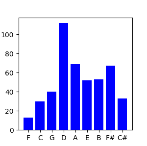
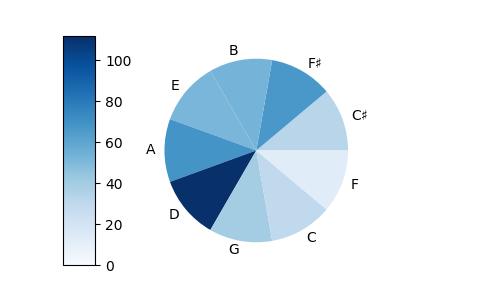
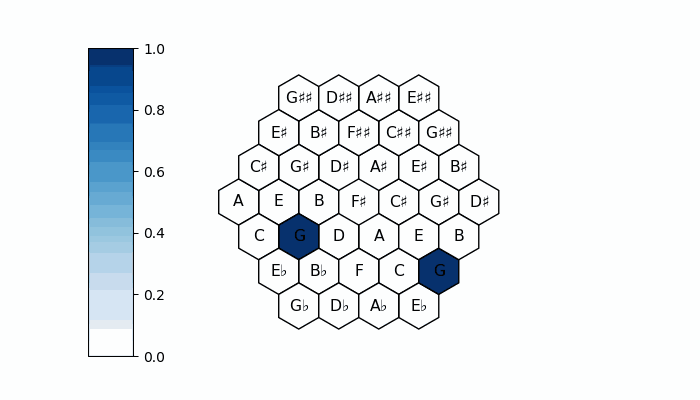
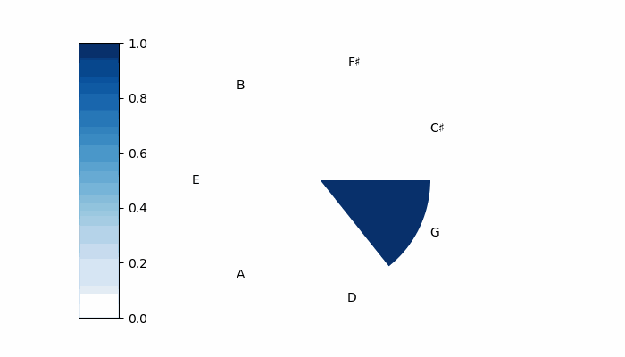

# pitchplots


A python library for plotting note distributions in different tonal spaces.
This branche have the dynamic module and correspond to the version 1.3.4

## Getting Started

The library contains the following files
* `functions.py`, 
* `reader.py`, 
* `modified_music_xml.py`, 
* `parser.py`
* `static.py`, and
* `dynamic.py`

### Prerequisites

In order to use **pitchplots** you need a running Python 3 environment and the following libraries:
* matplotlib
* pandas
* numpy
* moviepy

to install these libraries, you can do the following command in the prompt:

```
python3 -m pip install matplotlib>=3.0.1 pandas>=0.23.4 numpy>=1.15.3 moviepy>=1.0.0
```

or if you're using the Anaconda prompt

```
pip install matplotlib>=3.0.1 pandas>=0.23.4 numpy>=1.15.3 moviepy>=1.0.0
```

Or you can use the requirements.txt file in the github.
Dont' forget to set the path to the one of the requirements file.

```
python3 -m pip install -r requirements.txt
```

### Installation

You can install the pitchplots package on pypi with pip using the following command in the prompt:

```
python3 -m pip install pitchplots
```

or if you're using the Anaconda prompt

```
pip install pitchplots
```
## Functions

    
    

**Pitchplots** has currently three plotting functions
-   `tonnetz` uses a `.csv` file or a pandas DataFrame of a piece of music to do a hexagonal 2D representation ("Tonnetz").
-   `circle` uses a csv file or a pandas DataFrame of a piece of music to represent the notes by fifth or chromatic.
-   `line` uses a csv file or a pandas DataFrame of a piece of music to represent the notes by fifth or chromatic on a line, the unrolled equivalent to the circle function.

Two animation functions
-   `tonnetz_animation` plot the same graphs as the `tonnetz` function but is animated.
-   `circle_animation` plot the same graphs as the `circle` function but is animated.

and one function to parse (compressed) MusicXML files and uncompressed xml files
-   `xml_to_csv` uses a `.mxl` or `.xml` file and parses it into a `.csv` file using the [TensorFlow Magenta](https://github.com/tensorflow/magenta) `musicxml_parser.py`.

## Working with files

### Parsing

**Pitchplots** plots note distributions from MusicXML files (`.xml` or `.mxl`). You can either specify your own file or use the [test file](data_example.mxl) `data_example.mxl`. contained in the package.

The first step is to parse the file into a note list representation that is stored in a pandas DataFrame where each line corresponds to a note or a rest.

```python
import pitchplots.parser as ppp

# If no filepath is specified, will automatically charge data_example.mxl
df_data_example = ppp.xml_to_csv(save_csv=True)
```

To use your own file, add `filepath=` with the location of your file in the parameters of the function `xml_to_csv`.

### Plotting

In order to plot the notes of a piece, import the `pitchplots.static` module and use one of its plotting functions. They take as input the output of the parser, i.e. either a DataFrame object:

```python
import pitchplots.static as pps

pps.tonnetz(df_data_example)
```
 or a CSV file:
```python
import pitchplots.static as pps

pps.tonnetz('csv/data_example.csv')
```
In both cases the output should look like the following image (of course, the note distribution depends on the piece you are plotting):


Or if you want to plot a line:

```python
import pitchplots.static as pps

pps.line(df_data_example)
```
 or a CSV file:
```python
import pitchplots.static as pps

pps.line('csv/data_example.csv')
```

In both cases the output should look like the following image (of course, the note distribution depends on the piece you are plotting):



Or if you want to plot a circle:

```python
import pitchplots.static as pps

pps.circle(df_data_example)
```
 or a CSV file:
```python
import pitchplots.static as pps

pps.circle('csv/data_example.csv')
```

In both cases the output should look like the following image (of course, the note distribution depends on the piece you are plotting):



### Animations

In order to create an animated plot of a piece, import the `pitchplots.dynamic` module and use its plotting function. It takes as input the output of the parser, i.e. either a DataFrame object:

```python
import pitchplots.dynamic as ppd

# the example takes only the measures 1 to 4 because the function can take some time for a long video
ppd.tonnetz_animation(df_data_example, measures=[1, 4])
```
 or a CSV file:
```python
import pitchplots.dynamic as ppd

# the example takes only the measures 1 to 4 because the function can take some time for a long video
ppd.tonnetz_animation('csv/data_example.csv', measures=[1, 4])
```

Or if you want a circle animation:

```python
import pitchplots.dynamic as ppd

# the example takes only the measures 1 to 4 because the function can take some time for a long video
ppd.circle_animation(df_data_example, measures=[1, 4])
```
 or a CSV file:
```python
import pitchplots.dynamic as ppd

# the example takes only the measures 1 to 4 because the function can take some time for a long video
ppd.circle_animation('csv/data_example.csv', measures=[1, 4])
```

you can also save it as a gif by specifying `filename='animation.gif'`. By default it produces a `.mp4` file. The result should look like the video below.

 

## detailed functionality

see the following files for more informations about the functions parser, line, circle, tonnetz, circle_animation and tonnetz_animation.

[parser documentation](notebooks/parser_doc.ipynb)
[line documentation](notebooks/line_doc.ipynb)
[circle documentation](notebooks/circle_doc.ipynb)
[tonnetz documentation](notebooks/tonnetz_doc.ipynb)
[circle animation documentation](notebooks/circle_anim_doc.ipynb)
[tonnetz animation documentation](notebooks/tonnetz_anim_doc.ipynb)

## Further Information
### Authors
* [**Fabian C. Moss**](https://github.com/fabianmoss)
* [**Timothy Loayza**](https://github.com/TimothyLoayza)

### Usage of Magenta's code

The [modified_musicxml_parser.py](modified_musicxml_parser.py) file is taken from the [TensorFlow Magenta](https://github.com/tensorflow/magenta) project and has been modified. See the [modifications](magenta/magenta_musicxml_code_modifications.md) and the [Magenta License](magenta/magenta_LICENSE.md).

### License

Pitchplots is licensed under the MIT License - see the [LICENSE](LICENSE.md) file for details
