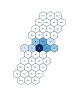

# pitchplots


A python library for plotting note distributions in different tonal spaces.

## Getting Started

The library contains the following files
* `functions.py`, 
* `reader.py`, 
* `modified_music_xml.py`, 
* `parser.py`, and 
* `static.py`

### Prerequisites

In order to use **pitchplots** you need a running Python environment and the following libraries:
* matplotlib
* pandas
* numpy

If you are using the Anaconda distribution, these libraries are already installed.

### Installation

You can install the pitchplots package on pypi with pip using the following command in the prompt:

```
python3 -m pip install pitchplots
```

or if you're using the Anaconda prompt

```
pip install pitchplots
```
## Functions

    
    

**Pitchplots** has currently two plotting functions
-   `hexagonal_chart` uses a `.csv` file or a pandas DataFrame of a piece of music to do a hexagonal 2D representation ("Tonnetz").
-   `pie_chart` uses a csv file or a pandas DataFrame of a piece of music to represent the notes by fifth or chromatic.
and one function to parse (compressed) MusicXML files
-   `xml_to_csv` uses a `.mxl` or `.xml` file and parses it into a `.csv` file using the [TensorFlow Magenta](https://github.com/tensorflow/magenta) `musicxml_parser.py`.

## Working with files

### Parsing

**Pitchplots** plots note distributions from MusicXML files (`.xml` of `.mxl`). You can either specify your own file or use the [test file](data_example.mxl) `data_example.mxl`. contained in the package.

The first step is to parse the file into a note list representation that corresponds to a pandas DataFrame where each line is a note or a rest.

```python
import os

import pitchplots
import pitchplots.parser as ppp

path = os.path.join(pitchplots.__path__[0], 'data_example.mxl')
df_data_example = ppp.xml_to_csv(path, save_csv=True)
```

To use your own file, replace `path` with the path to your file.

### Plotting

In order to plot the notes of a piece, import the `pitchplots.static` module and use one of its plotting functions. They take as input the output of the parser, i.e. either a DataFrame object:

```python
import pitchplots.static as pps

pps.hexagonal_chart(df_data_example)
```
 or a CSV file:
```python
import pitchplots.static as pps

pps.hexagonal_chart('csv/data_example.csv')
```
In both cases the output should look like the following image (of course, the note distribution depends on the piece you are plotting):


A more detailed overview about the functionality of the plotting functions is given in the notebooks [documentation_hexagonal_chart.ipynb](documentation_hexagonal_chart.ipynb) for information on `hexagonal_chart` and [documentation_pie_chart.ipynb](documentation_pie_chart.ipynb) for information on `pie_chart information`.

## Further Information
### Authors
* [**Fabian C. Moss**](https://github.com/fabianmoss)
* **Timothy Loayza** - *Initial work* - [pitchplots](https://github.com/DCMLab/pitchplots)

### Usage of Magenta's code

The [modified_musicxml_parser.py](modified_musicxml_parser.py) file is taken from the [TensorFlow Magenta](https://github.com/tensorflow/magenta) project and has been modified. See the [modifications](magenta_musicxml_code_modifications.md) and the [Magenta License](magenta_LICENSE.md).

### License

Pitchplots is licensed under the MIT License - see [LICENSE.md](LICENSE.md) file for details
